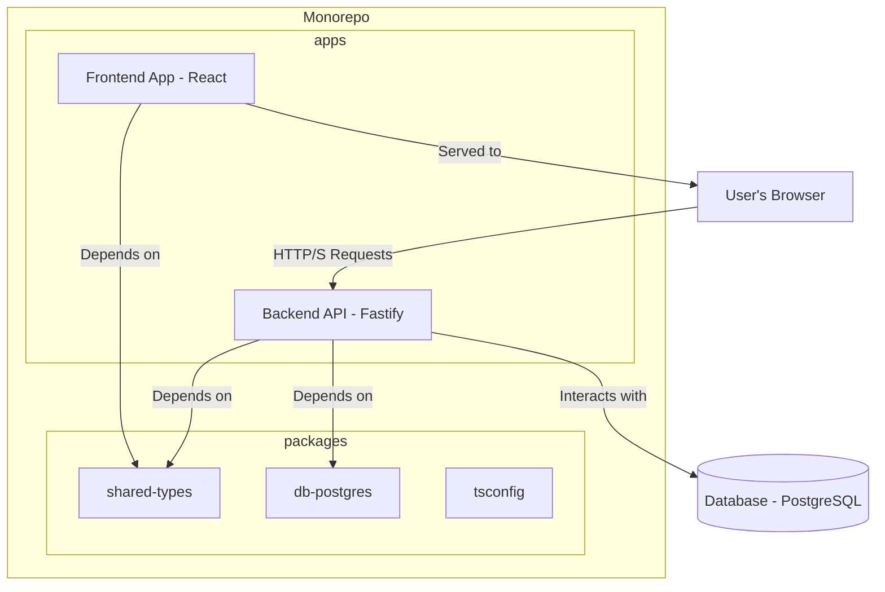

# Architecture Overview

This document describes the software architecture of the AdopteUnEtudiant platform, including the key technology choices, structural design, and underlying architectural patterns that ensure scalability and maintainability.

---

## 1. Technology Choices

The technologies for this project were selected to build a modern, robust, and high-performance web application.

-   **Backend**: **[Fastify](https://www.fastify.io/)** was chosen for its high performance and low overhead. Its plugin-based architecture makes it extensible and well-suited for building robust APIs.
-   **Frontend**: **[React](https://reactjs.org/)** (with **[Vite](https://vitejs.dev/)**) was selected for its component-based model, which promotes reusability and simplifies complex UI development. Vite provides a fast and modern development experience.
-   **Database**: **[PostgreSQL](https://www.postgresql.org/)** is a powerful, open-source object-relational database system with a strong reputation for reliability, feature robustness, and performance.
-   **ORM**: **[Prisma](https://www.prisma.io/)** serves as the next-generation ORM. It provides a type-safe database client and a declarative schema, which simplifies database interactions and helps prevent common errors like SQL injection.
-   **Language**: **[TypeScript](https://www.typescriptlang.org/)** is used for both the backend and frontend, ensuring type safety across the entire stack. This reduces bugs and improves the developer experience.
-   **Monorepo Tooling**: **[Turborepo](https://turbo.build/)** and **npm Workspaces** are used to manage the project as a monorepo, simplifying dependency management and cross-package integration.

---

## 2. System Architecture

The project is designed with a classic **Client-Server** model but is housed within a **Monorepo** to streamline development.

-   **The Client (Browser)**: The React single-page application (`apps/web`) is downloaded and executed in the user's browser. It is responsible for the user interface (UI) and user experience (UX).
-   **The Server (Backend)**: The Fastify API (`apps/api`) runs on a Node.js server. Its responsibilities are to:
    -   Expose data via a RESTful API.
    -   Handle all business logic (e.g., creating applications, managing users).
    -   Authenticate and authorize users.
    -   Communicate with the PostgreSQL database via Prisma.

---

## 3. Monorepo Structure

The monorepo contains two main directories: `apps` and `packages`.

-   **`apps/`**: Contains the runnable applications.
    -   `api`: The backend server.
    -   `web`: The frontend React application.
-   **`packages/`**: Contains shared code and configuration.
    -   `db-postgres`: The Prisma client, schema, and migration files.
    -   `shared-types`: Shared TypeScript types and Zod schemas used for validation, ensuring consistency between the frontend and backend.
    -   `tsconfig`: Shared TypeScript configuration.

This structure allows for atomic commits that affect both frontend and backend, while still maintaining a clear separation of concerns.

---

## 4. Backend N-Tier Architecture

The backend (`apps/api`) is organized into logical layers to separate responsibilities.

-   **Presentation Layer (Routes & Middlewares)**: This is the entry point of the API. It defines the URL endpoints, validates incoming request shapes, and handles cross-cutting concerns like authentication (`authMiddleware`) and authorization (`roleMiddleware`).
-   **Application Layer (Controllers)**: This layer orchestrates the application's business logic. It receives validated requests from the presentation layer and uses the services of the lower layers to fulfill them.
-   **Data Access Layer (ORM)**: This is the lowest layer, responsible for all communication with the database. The Prisma ORM abstracts away the raw SQL, providing a secure, type-safe interface for data manipulation.

> For a detailed guide on how to add new features within this structure, see the **[Development Guide](Development-Guide.md)**.
