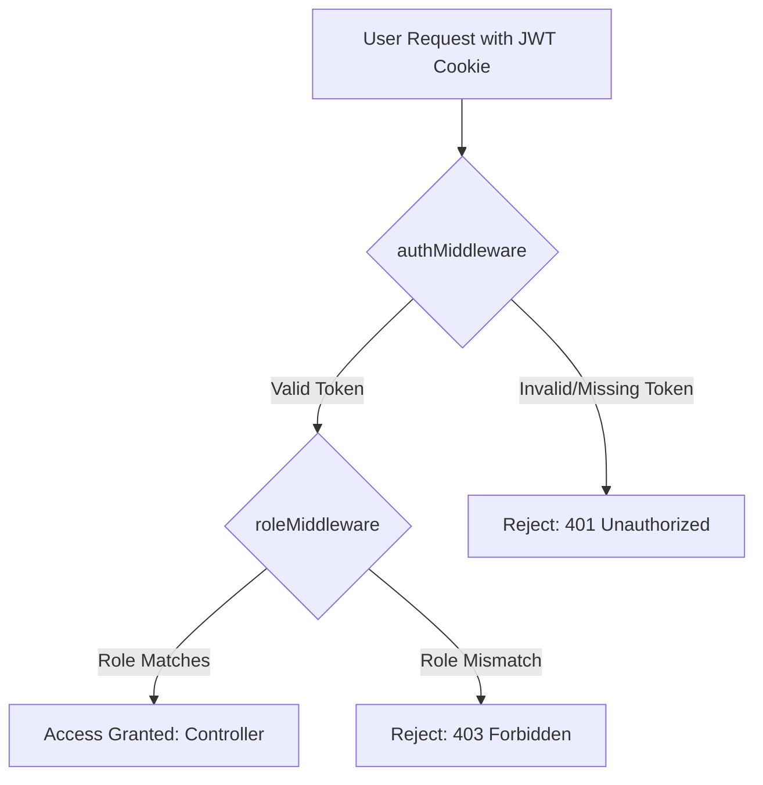

# Authentication Flow

The authentication system is a critical component of the platform, designed to be both secure and flexible. This document details the authentication methods, session management, and access control mechanisms.

---

## 1. Authentication Methods

Users can authenticate in two ways:

### a. Email & Password

-   **Registration**: A user provides an email and password.
-   **Security**: The password is **never** stored in plaintext. It is irreversibly hashed using the **`bcryptjs`** algorithm.
-   **Login**: During login, the provided password is aynchronously hashed and compared to the hash stored in the database.

### b. Google OAuth 2.0

-   **Flow**: The authentication process is delegated to Google.
    1.  The user clicks "Continue with Google".
    2.  They are redirected to Google to authenticate.
    3.  Google redirects them back to our API's callback URL (`/api/auth/google/callback`) with an authorization code.
    4.  Our backend securely exchanges this code with Google for the user's profile information (email, name).
-   **Logic**: The backend checks if a user with this email already exists.
    -   If yes, it logs them in.
    -   If no, it creates a new user and then logs them in, prompting them to complete their profile.

---

## 2. Session Management with JWT

Once a user is authenticated, the server creates a session for them using a **JSON Web Token (JWT)**.

### a. JWT Creation and Payload

After a successful login, the server generates a signed JWT containing a payload with essential, non-sensitive user information.

**Payload Structure:**
```json
{
  "id": "user_id_from_database",
  "email": "user@example.com",
  "role": "STUDENT" or "COMPANY",
  "iat": 1678886400, // Issued at timestamp
  "exp": 1678972800  // Expiration timestamp (e.g., 24 hours)
}
```

### b. Secure Cookie Storage

The JWT is sent to the client and stored in a secure cookie with the following attributes:

-   **`httpOnly`**: This is a critical security measure that prevents the cookie from being accessed by client-side JavaScript. It is the primary defense against **Cross-Site Scripting (XSS)** attacks stealing the session token.
-   **`Secure`**: In production, this flag ensures the cookie is only sent over HTTPS.
-   **`SameSite=Strict`**: Provides protection against Cross-Site Request Forgery (CSRF) attacks.

The browser automatically includes this cookie with every subsequent request to our API.

---

## 3. Access Control (Authorization)

Authentication confirms _who_ a user is. Authorization determines _what they are allowed to do_.

This is handled by a chain of two middlewares on protected routes.



### a. `authMiddleware`

-   **Purpose**: This is the first gatekeeper for any protected route.
-   **Function**:
    1.  Checks for the presence of the JWT cookie.
    2.  Verifies the JWT's signature to ensure it hasn't been tampered with.
    3.  Checks the token's expiration.
    4.  If valid, it decodes the payload and attaches it to the Fastify request object as `request.user`.
-   If the token is invalid or missing, the middleware immediately rejects the request with a `401 Unauthorized` error.

### b. `roleMiddleware`

-   **Purpose**: This is the second gatekeeper, used to enforce Role-Based Access Control (RBAC).
-   **Function**: This middleware is configured with an array of allowed roles (e.g., `['COMPANY']`). It compares the `role` from the `request.user` object (placed there by `authMiddleware`) against the allowed roles.
-   **Example**: The route to create an offer (`POST /api/offers`) is protected by `roleMiddleware(['COMPANY'])`. If a user with the `STUDENT` role attempts to access it, the middleware will block the request with a `403 Forbidden` error, even if their JWT is perfectly valid.
