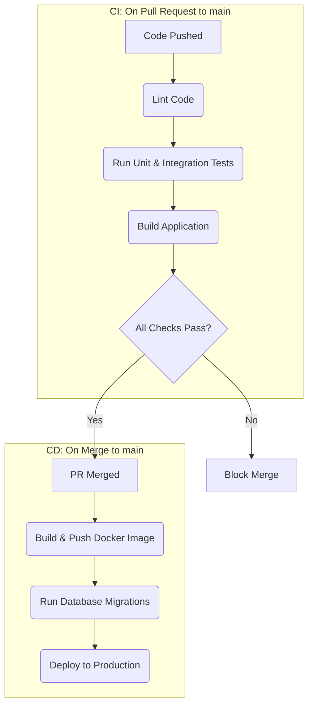

# CI/CD Pipeline

This document describes the Continuous Integration and Continuous Deployment (CI/CD) pipeline for the project, implemented using **GitHub Actions**.

## 1. Pipeline Objectives

-   **Continuous Integration (CI)**: To automatically validate that every code change (on push or pull request) meets quality standards, does not break existing functionality, and is ready to be merged.
-   **Continuous Deployment (CD)**: To automatically deploy every new version of the `main` branch to a production-like environment without manual intervention.

---

## 2. CI/CD Workflow Visualization

---

## 3. Continuous Integration (CI) Protocol

This pipeline is triggered on every `push` and `pull_request` targeting the `main` branch. Its purpose is to act as a quality gate.

-   **Workflow File**: `.github/workflows/ci-cd.yml`

-   **Key Steps**:
    1.  **Checkout Code**: The workflow checks out the latest version of the source code.
    2.  **Setup Environment**: It installs Node.js (v20) and caches dependencies for speed.
    3.  **Install Dependencies**: It runs `npm ci` instead of `npm install`. `ci` uses the `package-lock.json` file to ensure a clean, reproducible, and fast installation of exact dependency versions.
    4.  **Linting**: It runs `npm run lint`. This step checks the entire codebase for stylistic errors and programming mistakes using ESLint, ensuring code consistency and quality.
    5.  **Automated Tests (Future Implementation)**: It will run `npm test`. This step executes the full suite of unit and integration tests with Vitest. It verifies that all existing functionality works as expected and prevents regressions. A code coverage report will also be generated.
    6.  **Build Application**: It runs `npm run build`. This step compiles the frontend and backend applications into their production-ready artifacts. It's a final verification that the code is syntactically correct and can be deployed.

If any of these steps fail, the workflow is marked as "failed," and the pull request is blocked from being merged (assuming branch protection rules are enabled).

---

## 4. Continuous Deployment (CD) Protocol

This pipeline runs **only** when a change is pushed or merged into the `main` branch, and only if the preceding CI pipeline was successful.

-   **Strategy**: The approach uses **Docker** containers for the backend and a **PaaS (Platform as a Service)** like Render or Heroku for simplified, automated deployments.

-   **Key Steps**:
    1.  **Login to Container Registry**: The workflow authenticates to a Docker image registry (e.g., GitHub Container Registry or Docker Hub).
    2.  **Build and Push Docker Image**:
        -   A production-optimized Docker image for the API (`apps/api`) is built using the `Dockerfile`.
        -   This image is tagged with a unique identifier (like the Git commit hash) and pushed to the container registry.
    3.  **Trigger Deployment via Webhook**:
        -   The workflow sends a secure HTTP POST request to a unique **"Deploy Hook"** URL provided by the hosting platform.
        -   Upon receiving this webhook, the PaaS automatically pulls the newest Docker image from the registry and restarts the service with the new version.
    4.  **Run Database Migrations**: The hosting platform's startup command is configured to run the production migration script (`npm run db:migrate:prod`) *before* starting the new application container. This ensures the database schema is compatible with the new code.
    5.  **Frontend Deployment**: The frontend (`apps/web`) is a static site. Most modern platforms (like Vercel or Netlify) can be configured to automatically watch the `main` branch and trigger a new build and deployment upon every push, independent of the backend's Docker workflow.

For the concrete implementation details, see the workflow file: **[.github/workflows/ci-cd.yml](../.github/workflows/ci-cd.yml)**.
